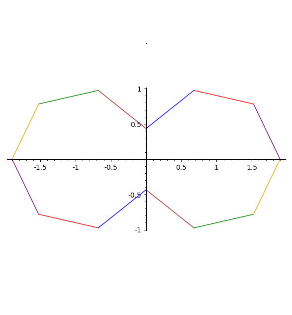

I have defended my PhD in December 2023 under the supervision of <em>Erwan Lanneau</em> and <em>Daniel Massart</em>. From September 2024 onwards I will be a postdoc researcher at the <a href="https://www.cmm.uchile.cl//"> Centro de Modelamiento matematico </a> in Santiago de Chile, with <em>Rodolfo Gutiérrez-Romo</em>.

I am interested in dynamics and geometry of surfaces. I specifically study translation surfaces and their Veech groups. My other mathematical interests include interval exchange transformations,
continued fractions and Anosov dynamics. Here is my [CV](/assets/CV_en.pdf), and a [research statement](/assets/Research_Statement_en.pdf).

<h2> Preprints </h2>

6. Algebraic intersections on Bouw-Möller surfaces, and more general convex polygons, with Irene Pasquinelli, 2024. <a href="https://arxiv.org/abs/2409.01711"> See on arxiv</a>.

5. Algebraic intersection, lengths and Veech surfaces, 2023. <a href="https://arxiv.org/abs/2309.17165"> See on arxiv</a>.

<h2> Published and accepted papers </h2>

{4.} Lower bound for KVol on the minimal stratum of translation surfaces. <em>Geometria Dedicata</em> 218, 88 (2024). <a href="https://arxiv.org/abs/2310.00130"> See on arxiv</a> or
<a href="https://link.springer.com/article/10.1007/s10711-024-00937-9"> see on Springer Link</a>.

3. Algebraic intersection in regular polygons,
with Erwan Lanneau and Daniel Massart, 2022. To appear in <em> Annales Henri Lebesgue </em>.
<a href="https://arxiv.org/abs/2110.14235"> See on arxiv</a>.

2. There are no primitive Teichmüller curves in Prym(2,2),
with Sam Freedman, 2022. <em>Comptes rendus de l'académie des sciences</em>. Volume 362 (2024), pp. 167-170.
<a href="https://arxiv.org/abs/2211.09737"> See on arxiv</a> or
<a href="https://comptes-rendus.academie-sciences.fr/mathematique/articles/10.5802/crmath.551/"> see on the Comptes Rendus webpage</a>.

1. Central points of the double heptagon translation surface are not connection points.
<em>Bulletin de la SMF</em>, Vol.150(2) (2022), pp. 459-472. 
<a href="https://arxiv.org/abs/2009.01748"> See on arxiv</a> or
<a href="https://smf.emath.fr/publications/les-points-centraux-du-double-heptagone-ne-sont-pas-des-points-de-connexion"> see on the SMF webpage</a>.

<h2> PhD defense </h2>
I started my PhD on September 2021 under the supervision of Erwan Lanneau and Daniel Massart and defended in December 2023 at the Institut Fourier, Université Grenoble Alpes. The slides are available [here](/assets/Soutenance.pdf) as well as the [manuscript](/assets/manuscript.pdf). You can also find [here](/assets/fiche_explicative.pdf) a small explication of my work which was meant for non-matematicians attending my PhD defense.

<video width="320" height="240" autoplay muted>
  <source src="assets/img/Dom_fond_penta.mp4" type="video/mp4">
Your browser does not support the video tag.
</video> 
A fundamental domain for the SL(2,R)-orbit of the golden L.